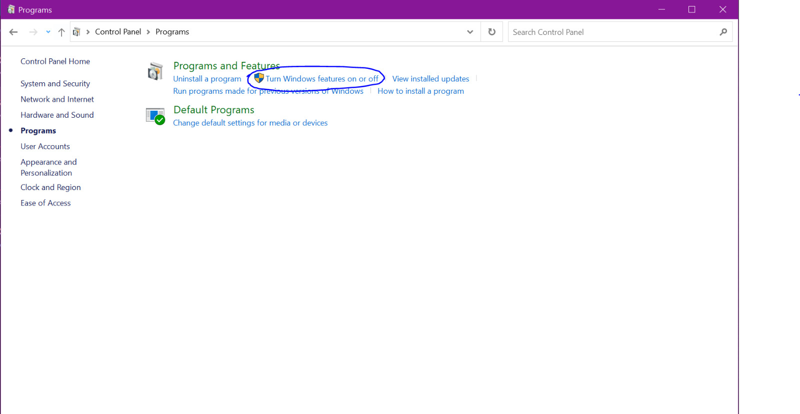
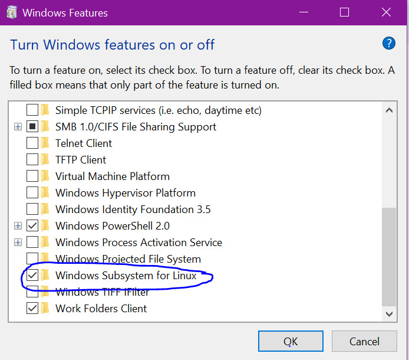
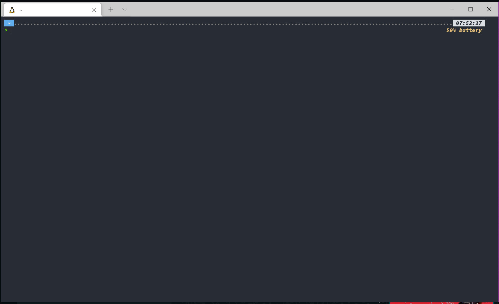

# WSL

This guide will go through installing and setting up WSL**1** on **Windows 10**

## Table of Contents

-   [1. General Dependencies](#1-general-dependencies)
-   [2. Guide](#2-guide)
    -   [2.1. Enabling WSL](#21-enabling-wsl)
        -   [2.1.1 Using Windows Powershell](#211-using-windows-powershell)
        -   [2.1.2 Using Control Panel](#212-using-control-panel)
    -   [2.2. Installing Linux Distribution](#22-installing-linux-distribution)
    -   [2.3. Installing Windows Terminal (Optional)](#23-installing-windows-terminal-optional)
-   [3. Conclusion](#3-conclusion)
-   [4. References](#4-references)

# 1. General Dependencies

This guide assumes that you are using the **Windows 10** OS.

# 2. Guide

## 2.1. Enabling WSL

There are 2 ways to enable the WSL feature on your laptop:

1. Using Windows Powershell
2. Using the Control Panel

You can use whichever method you are more comfortable with, the steps are below.

### 2.1.1 Using Windows Powershell

First, run Windows Powershell as Administrator and type in the following command:

```powershell
dism.exe /online /enable-feature /featurename:Microsoft-Windows-Subsystem-Linux /all /norestart
```

Once done, restart in order for the change to take place.

### 2.1.2 Using Control Panel

First, open your Control Panel and navigate to 'Programs'. Find the 'Turn Windows Feature on or off' tab by the side and click on it.



Scroll until you find the 'Windows Subsystem for Linux' option and check it.



Once done, you can click the 'Ok' button to save and close. Windows should then give you a prompt to restart. You can choose to restart later or restart now but WSL will only be enabled once you restart.

## 2.2. Installing Linux Distribution

Now that you have enabled WSL, you can head to the Microsoft Store and install a Linux Distribution.

First, open Microsoft Store and search for your preferred Distribution. Then, click 'Get', then 'Install'.

Once the installation has completed, you can then launch the Distribution similar to how you would launch a normal Software.

The first time you launch a Distribution, you will be prompted to create a new user and password. Just type in the username as well as your password when the prompt shows.

You've now completed the base installation of WSL onto your Windows!

## 2.3. Installing Windows Terminal (Optional)

Installing Windows Terminal is Optional and not technically required for you to use WSL. However, it does come with support that makes the customization of your Terminal easier.

Installing Windows Terminal is also easy. Just go to the Microsoft Store and search for it. Then, click 'Get' and 'Install'. Once the installation is completed, you can then launch it like any other normal Software.

You can then choose and customize the different profiles and terminals you have.

# 3. Conclusion

If you've made it to this point, you can now use WSL on your Windows device!

Below is a screenshot of my Windows Terminal, with some extra customization. If you want to know more about how to customise your Windows Terminal, head [here](../../linux/my-terminal-setup/README.md)



# 4. References

-   [Powershell Installation](https://docs.microsoft.com/en-us/windows/wsl/install-manual)
-   [Control Panel Installation](https://www.windowscentral.com/install-windows-subsystem-linux-windows-10)

### Updates

-   **04/11/2022** - Guide Completed
